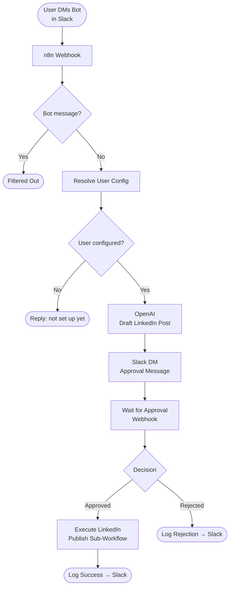

# Slack → OpenAI → LinkedIn Publisher

An n8n workflow that lets team members DM a Slack bot with an article URL, uses OpenAI (GPT-4.1 mini) to generate a polished LinkedIn post draft, routes it through a private human approval gate, and then publishes it to each person's LinkedIn account — with structured error logging back to Slack.

Multiple team members are supported out of the box: each person's LinkedIn account, display name, and sub-workflow reference are stored in a single `USER_CONFIG` env var.

---

## Architecture Overview



---

## Prerequisites

### Required Software
- **Docker Desktop** — https://www.docker.com/products/docker-desktop
- **Git** — https://git-scm.com/
- A modern browser (Chrome recommended)

> **ngrok is bundled inside the Docker image.** No separate ngrok download or installation is needed.

### Required Accounts
- Slack workspace where you can create apps
- LinkedIn account for each team member who will publish
- OpenAI account with API access

---

## Repository Structure

```
linkedin-article-agent/
│
├── Dockerfile                  ← Custom image: n8n + ngrok
├── docker-compose.yml
├── docker-entrypoint.sh        ← Starts ngrok (optional) then n8n
├── .dockerignore
├── .gitignore
│
├── workflow/
│   ├── slack-to-linkedin-publisher.json    ← Main workflow
│   ├── linkedin-publish-user1.json         ← LinkedIn sub-workflow, user 1
│   ├── linkedin-publish-user2.json         ← LinkedIn sub-workflow, user 2
│   └── linkedin-publish-user3.json         ← LinkedIn sub-workflow, user 3
│
└── README.md
```

---

## Step 1 — Clone the Repository

```bash
git clone https://github.com/YOUR_ORG/slack-to-linkedin-n8n.git
cd slack-to-linkedin-n8n
```

---

## Step 2 — Create `.env` File

```bash
cp .env.example .env
```

### `.env` variables explained

```env
# n8n runtime
N8N_HOST=localhost
N8N_PORT=5678
N8N_PROTOCOL=http
N8N_EDITOR_BASE_URL=https://your-ngrok-domain.ngrok-free.app
N8N_ENCRYPTION_KEY=                    # generate: openssl rand -hex 16
N8N_BLOCK_ENV_ACCESS_IN_NODE=false

# Public base URL used for webhook callbacks and approval button links
WEBHOOK_URL=https://your-ngrok-domain.ngrok-free.app

# ngrok — omit NGROK_AUTHTOKEN entirely to disable ngrok
NGROK_AUTHTOKEN=                       # from https://dashboard.ngrok.com
# NGROK_DOMAIN=your-static-subdomain.ngrok-free.app  # optional static domain

# Per-user config: maps Slack user ID → LinkedIn person ID, display name,
# and the n8n workflow ID of that user's LinkedIn publish sub-workflow.
# sub_workflow_id is filled in after the first deploy (see Step 5b below).
USER_CONFIG={"SLACK_ID_1":{"linkedin_person_id":"LI_ID_1","name":"Alice","sub_workflow_id":"N8N_WF_ID_1"},"SLACK_ID_2":{"linkedin_person_id":"LI_ID_2","name":"Bob","sub_workflow_id":"N8N_WF_ID_2"},"SLACK_ID_3":{"linkedin_person_id":"LI_ID_3","name":"Chance","sub_workflow_id":"N8N_WF_ID_3"}}

# Shared Slack channel for team-visible logging (approvals go to individual DMs)
LOG_CHANNEL_ID=C0AG7573N0Y
```

**Finding each value:**
- **Slack user ID** — open Slack profile → ⋮ menu → *Copy member ID* (starts with `U`)
- **LinkedIn person ID** — call `GET https://api.linkedin.com/v2/userinfo` with the user's OAuth token; use the `sub` field
- **`sub_workflow_id`** — leave as placeholder for now; filled in after Step 5b

> **Service credentials** (OpenAI API key, Slack Bot Token, LinkedIn OAuth) are stored inside n8n's encrypted database — they are not in `.env`.

⚠️ **Never commit `.env` to GitHub**

---

## Step 3 — Build and Start the Container

```bash
docker compose up -d --build
```

Verify:
- n8n UI: http://localhost:5678
- ngrok started automatically when `NGROK_AUTHTOKEN` is set

```bash
docker compose logs n8n | grep -i ngrok
```

---

## Step 4 — Confirm the ngrok Tunnel URL

If you set `NGROK_DOMAIN`, your tunnel URL is fixed — skip this step.

Otherwise, inspect logs:
```bash
docker compose logs n8n
```
Look for: `Forwarding https://revisional-xxxxx.ngrok-free.dev -> http://localhost:5678`

Copy the HTTPS ngrok URL — you need it for the Slack app setup.

---

## Step 5 — Import Workflows into n8n

### 5a — Import all four workflows

1. Open http://localhost:5678
2. Click **Import Workflow** and import each file in `workflow/`:
   - `slack-to-linkedin-publisher.json` ← main workflow
   - `linkedin-publish-user1.json`
   - `linkedin-publish-user2.json`
   - `linkedin-publish-user3.json`
3. Save each workflow after importing

### 5b — Record the sub-workflow IDs

After importing, each sub-workflow has a URL like:
```
http://localhost:5678/workflow/12345
```
The number at the end is the n8n workflow ID. Update `.env` with these IDs:

```env
USER_CONFIG={"SLACK_ID_1":{"linkedin_person_id":"LI_ID_1","name":"Alice","sub_workflow_id":"12345"},...}
```

Restart the container to apply the updated env:
```bash
docker compose restart
```

---

## Step 6 — Create Credentials in n8n

### OpenAI
- Credentials → New → **OpenAI API**
- Enter your API key

### Slack
- Credentials → New → **Slack**
- Use **Bot User OAuth Token** (starts with `xoxb-...`)

### LinkedIn (one credential per team member)
- Credentials → New → **LinkedIn OAuth2 API**
- Repeat for each user who will publish
- After creating, note each credential's ID from the n8n UI URL or API

#### Wire credentials to sub-workflows

For users 2 and 3, open their sub-workflow JSON files and replace the placeholder credential IDs:

```json
"credentials": {
  "linkedInOAuth2Api": {
    "id": "REPLACE_WITH_USER2_LINKEDIN_CRED_ID",   ← replace this
    "name": "LinkedIn account (User 2)"
  }
}
```

Re-import the updated files (or update via the n8n UI directly).

---

## Step 7 — Slack App Setup

### Create Slack App
1. https://api.slack.com/apps → **Create New App → From scratch**
2. Select your workspace

### OAuth & Permissions — Bot Token Scopes
```
chat:write
im:read
im:write
im:history
```

Install app to workspace and copy the **Bot User OAuth Token**.

### Event Subscriptions
1. Enable **Event Subscriptions**
2. Request URL:
   ```
   https://YOUR_NGROK_DOMAIN/webhook/slack/events
   ```
3. Wait for **Verified**
4. Subscribe to bot events:
   - `message.im` ← direct messages to the bot (replaces `message.channels`)

### App Home
Enable the **Messages Tab** so users can DM the bot directly.

---

## Step 8 — LinkedIn App Setup

### Create LinkedIn App
https://www.linkedin.com/developers/apps

### OAuth Settings
- Redirect URL:
  ```
  http://localhost:5678/rest/oauth2-credential/callback
  ```

### Required Scopes (personal posting)
- `w_member_social`
- `openid`
- `profile`
- `email`

⚠️ After changing scopes, re-authenticate each user's credential in n8n.

---

## Step 9 — Webhook URLs After Restart

**If `NGROK_DOMAIN` is set** (recommended): static URL, no action needed.

**If not set**: update on every restart:
1. Get new URL: `docker compose logs n8n`
2. Update Slack Event Subscriptions → Request URL
3. Update `.env` → `WEBHOOK_URL` and `N8N_EDITOR_BASE_URL`
4. Restart: `docker compose restart`

---

## Step 10 — Activate the Workflows

In n8n, activate:
1. `Slack → OpenAI → LinkedIn Publisher` (main workflow — this is the only one that needs to be Active)

The sub-workflows (`LinkedIn Publisher - User N`) are called programmatically and do not need to be Active themselves.

---

## Step 11 — Test End-to-End

1. **DM the bot** in Slack with an article URL:
   ```
   https://techcrunch.com/some-article
   ```
2. n8n drafts a LinkedIn post via OpenAI
3. The bot replies **in the same DM** with the draft and Approve / Reject buttons
4. Click **Approve**
5. Post appears on your LinkedIn profile

---

## How It Works

### 1. Trigger — Slack DM Webhook
When a user sends a direct message to the Slack bot, Slack fires a `message.im` event to the n8n webhook. A JavaScript code node handles URL verification challenges and normalises the payload.

### 2. Bot Message Filter
A single IF node checks whether `bot_id` is present. If yes, the message is from the bot itself and is silently dropped — preventing echo loops. Human DMs continue.

### 3. Resolve User Config
A Code node reads `USER_CONFIG` from the env and looks up the sender's Slack user ID. It attaches `user_linkedin_person_id`, `user_display_name`, and `sub_workflow_id` to the data.

If the user is not in `USER_CONFIG`, they receive a friendly DM: *"You're not yet configured — contact your team admin."* The execution stops there.

### 4. Respond to Webhook (Immediately)
A `Respond to Webhook` node fires in parallel immediately after event parsing to acknowledge Slack within the required 3-second window.

### 5. Prepare Input
Extracts `raw_text`, `source_channel`, `source_user`, and `source_ts`. Crucially, `source_channel` for a DM is already the private DM channel ID — no extra API call needed.

### 6. OpenAI API Call
Sends the message text to GPT-4.1 mini with a structured system prompt. Returns JSON with:

| Field | Description |
|---|---|
| `post_text` | 4–6 sentence LinkedIn post body |
| `post_link` | `"Read more here: <url>"` |
| `hashtags` | Array of hashtag strings |
| `safety_ok` | Boolean — safe to post? |
| `notes` | Caveats or rejection reasons |

### 7. Parse OpenAI Response → Set Channel IDs
Parses the JSON from OpenAI. Then sets runtime constants:
- `log_channel_id` — from `LOG_CHANNEL_ID` env var (shared team log channel)
- `approval_channel_id` — the user's DM channel (`source_channel`)
- `person_urn` — user's LinkedIn URN from `USER_CONFIG`

### 8. Check Parse Error / Safety Gate
Branches to Slack log messages if OpenAI output is unparseable or `safety_ok` is false.

### 9. Human Approval Loop
1. **Store Draft** — saves draft fields for later merging
2. **Build Approval Blocks** — constructs Slack Block Kit with draft text, OG image preview, and Approve/Reject buttons
3. **Send For Approval** — posts to `approval_channel_id` (the user's DM)
4. **Wait For Approval Reply** — pauses execution
5. **Merge Draft + Decision** — merges stored draft with the approval callback
6. **Approval Decision** — checks `?decision=approve`

### 10. On Approval — Execute LinkedIn Publish Sub-Workflow
**Build Final LinkedIn Text** formats the post, then **Execute LinkedIn Publish** calls the user's personal sub-workflow (identified by `sub_workflow_id` from `USER_CONFIG`). The sub-workflow handles the full LinkedIn publishing chain with that user's own OAuth2 credential:

- If the article has an `og:image`: Register LinkedIn Upload → Fetch Image Binary → Upload Image → Publish with image
- If no image: Publish text-only

### 11. Log Outcome
Success or rejection is logged to the shared `LOG_CHANNEL_ID` Slack channel, showing the user's display name.

---

## Workflow Diagram

```
Slack DM → Webhook
     │
     ├──► Respond to Webhook (immediate 200 OK)
     │
Parse Slack Event
     │
Is Bot Message? ──► [Filtered Out]
     │
Prepare Input
     │
Resolve User Config ──► [Not Configured Reply → DM]
     │
Is User Configured?
     │
OpenAI: Generate Draft
     │
Parse OpenAI Response
     │
Set Channel IDs  (log = LOG_CHANNEL_ID, approval = DM channel, person_urn = per user)
     │
Check Parse Error ──► [Log Parse Error → Slack]
     │
Safety Gate ──► [Log Safety Failure → Slack]
     │
Store Draft ──► Build Approval Blocks → Send For Approval (DM) → Wait For Approval Reply
                                                 │
                                      Merge Draft + Decision
                                                 │
                                       Approval Decision
                                      ┌──────────┴──────────┐
                                  [Approved]            [Rejected]
                                      │                      │
                          Build Final LinkedIn Text   Set Channel IDs (Rejection)
                                      │                      │
                        Execute LinkedIn Publish        Log Rejection
                         (per-user sub-workflow)             │
                                      │                 Log Error → Slack
                          Set Channel IDs (Success)
                                      │
                                Log Success → Slack
```

---

## Multi-User: Adding a New Team Member

1. Create a LinkedIn OAuth2 credential for them in n8n
2. Copy `workflow/linkedin-publish-user1.json` → `workflow/linkedin-publish-userN.json`
3. Change the `"name"` field to `"LinkedIn Publisher - User N"` and assign a new `"id"` (e.g. `"linkedin-pub-userN"`)
4. Replace all credential IDs in the new file with the new user's credential ID
5. Commit and push — CI/CD deploys it automatically
6. Note the n8n-assigned workflow ID from the UI
7. Add the user to `USER_CONFIG` in `.env` with their Slack ID, LinkedIn person ID, and the new workflow ID
8. Restart the container

---

## Common Issues & Fixes

### "Unknown webhook"
- Main workflow not Active
- Wrong URL (`/webhook-test` instead of `/webhook`)
- ngrok URL changed

### Slack `channel_not_found`
- Use **channel ID**, not name
- Confirm the bot has `im:write` scope for DMs

### LinkedIn 422 error
- Missing `visibility`, `lifecycleState`, or `specificContent`
- Body must be valid JSON in Expression mode

### Approval loses draft text
- Ensure **Store Draft → Merge → Approval Decision** pattern is intact

### LinkedIn image upload fails (400/401)
- Confirm `linkedin_person_id` in `USER_CONFIG` is correct (just the ID, not the full URN)
- The LinkedIn OAuth credential must have the `w_member_social` scope
- Re-authenticate the LinkedIn credential in n8n if the token has expired

### User gets "not configured" reply
- Their Slack user ID is missing from `USER_CONFIG` in `.env`
- Restart the container after editing `.env`

### Execute LinkedIn Publish fails with "workflow not found"
- The `sub_workflow_id` in `USER_CONFIG` doesn't match the actual n8n workflow ID
- Check the sub-workflow URL in n8n UI and update `.env`

---

## Security Notes

- Never commit `.env`
- Never commit `n8n_data/`
- Credentials are encrypted locally using `N8N_ENCRYPTION_KEY`
- `USER_CONFIG` contains Slack user IDs and LinkedIn person IDs — not secrets, but keep `.env` gitignored

---

## Overview

| Property | Value |
|---|---|
| Trigger | Direct message to Slack bot (`message.im`) |
| AI Model | `gpt-4.1-mini` via OpenAI Responses API |
| Approval | Human-in-the-loop via Slack DM reply |
| Output | LinkedIn post via HTTP API, per-user OAuth2 credentials |
| Logging | Shared Slack channel notifications for all outcomes |
| Multi-user | Supported — add entries to `USER_CONFIG` env var |

---

## Support

If something breaks:
1. Check container logs: `docker compose logs n8n`
2. Verify ngrok tunnel is up (look for `Forwarding https://...` in logs)
3. Check main workflow is Active in n8n
4. Check Slack Event Subscriptions show **Verified** and `message.im` is subscribed
5. Check n8n execution logs for the specific error node
