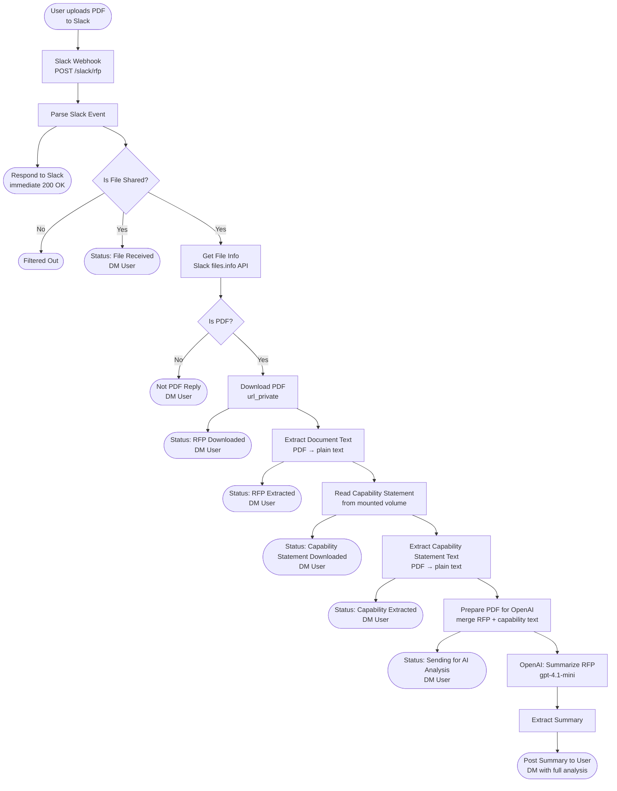

# Slack RFP AI Bot

An n8n workflow that lets team members upload an RFP PDF to Slack and instantly receive an AI-generated analysis — including an RFP summary, capability match, and a scored go/no-go recommendation — sent back as a private DM.

---

## Workflow: `Slack-RFP-AI.json`



---

## What the AI Returns

The OpenAI node (`gpt-4.1-mini`) returns a structured analysis with:

| Section | Content |
|---|---|
| **RFP Summary** | Project overview, key requirements, deadlines, scope, evaluation criteria |
| **Capability Match** | Strengths aligned with the RFP, gaps, missing certifications or insurance |
| **Pursuit Score** | Score out of 100 — capability alignment (40pts), past performance (20pts), likelihood of winning (20pts), deductions for gaps (up to 20pts) |
| **Recommendation** | Yes / No / Maybe with a one-sentence reason |

---

## Setup Requirements

### Credentials (in n8n)
- **Slack** — Bot User OAuth Token (`xoxb-...`) with scopes: `files:read`, `chat:write`, `im:write`
- **OpenAI** — API key wired to the `OpenAI: Summarize RFP` node

### Capability Statement
The workflow reads your firm's capability statement from a fixed path inside the container:

```
/home/node/.n8n-files/capability_statements/capability_statement.pdf
```

This file is mounted via `docker-compose.yml`. Replace it with your actual capability statement PDF before running the workflow.

### Slack App Events
Subscribe to bot events in your Slack app:

- `file_shared` — triggers the workflow when a user uploads a file

Request URL:
```
https://YOUR_NGROK_DOMAIN/webhook/slack/rfp
```

---

## Node Reference

| Node | Type | Purpose |
|---|---|---|
| Slack Webhook | Webhook | Entry point — receives Slack events at `/slack/rfp` |
| Parse Slack Event | Code | Handles URL verification, `/rfp` slash command, and `file_shared` routing |
| Respond to Slack | Respond to Webhook | Immediately acknowledges Slack (required within 3 s) |
| Is File Shared? | IF | Filters out non-file events |
| Get File Info | HTTP Request | Calls `files.info` to get file metadata and `url_private` |
| Is PDF? | IF | Checks `mimetype === application/pdf`; sends error DM if not |
| Download PDF | HTTP Request | Downloads the RFP binary using the bot token |
| Extract Document Text | Extract From File | Parses PDF binary → plain text |
| Read Capability Statement | Read/Write File | Reads the mounted capability statement PDF |
| Extract Capability Statement Text | Extract From File | Parses capability statement PDF → plain text |
| Prepare PDF for OpenAI | Code | Merges RFP text, capability text, and file metadata into one payload |
| OpenAI: Summarize RFP | HTTP Request | Calls `gpt-4.1-mini` with structured analysis prompt |
| Extract Summary | Code | Pulls `choices[0].message.content` from the OpenAI response |
| Post Summary to User | Slack | DMs the full analysis back to the uploader |
| Status: * nodes | Slack | Progressive DM status updates at each processing step |
